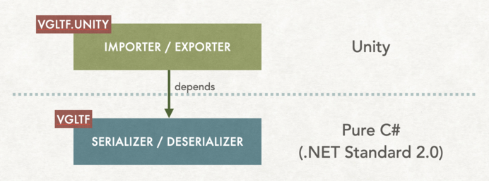

# VGltf 🗿

[](https://github.com/yutopp/VGltf/actions/workflows/ci.yml)
[](https://www.nuget.org/packages/VGltf/)
[](https://codecov.io/gh/yutopp/VGltf)
[](https://github.com/yutopp/VGltf/blob/master/LICENSE_1_0.txt)
[](https://github.com/KhronosGroup/glTF/tree/master/specification/2.0)


VGltf is a library that simplifies the import and export of glTF 2.0 assets in your C# standard and Unity projects.

<p align="center"></p>

## Key Features

- **Broad compatibility**: Designed for **both** `C# standard projects` and `Unity`, ensuring seamless integration.
- **Extensibility**: Easily extendable to accommodate custom glTF extensions with `hooks`.
  - For example, [VRM 0.x](https://github.com/vrm-c/vrm-specification) is [supported](/Packages/net.yutopp.vgltf.ext.vrm0) without modifying the core library.
- **Readability**: Clean and comprehensible codebase for quick learning and adaptation.
- **Stability**: Focused on reliability and performance across various projects.
- **Flexible support**: Compatible with `.NET Standard 2.0` or `higher` and tested on many platforms.

### Unity Compatibility

VGltf is compatible with `Unity 2019.4` or `higher` and supports the following:

- ⭕ Run-time import
- ⭕ Run-time export
- 🔺 Design-time (Unity Editor) import
  - Integration with AssetDatabase is not supported
- ⭕ Design-time (Unity Editor) export

Tested platforms include:

- Windows [Mono, IL2CPP]
- Linux [Mono, IL2CPP]
- MacOS [Intel and ARM] x [Mono, IL2CPP]
- iOS
- Android
- WebGL ([Sample project](https://github.com/yutopp/webgl-vgltf-sample) for `WebGL` with `Unity 2022.1`)

## Getting Started

### Import glTF file

The following code demonstrates how to import a glTF file and convert it into a Unity GameObject.
The input glTF data structure assumes multiple root nodes, which are combined into a single GameObject.

```csharp
using UnityEngine;
using System.IO;
using VGltf.Unity;
using VGltf;

var gltfContainer = default(GltfContainer);
using (var fs = new FileStream("Lantern.glb", FileMode.Open))
{
    gltfContainer = GltfContainer.FromGlb(fs);
}

var go = new GameObject();

var timeSlicer = new DefaultTimeSlicer();
var context = default(IImporterContext);
using (var gltfImporter = new Importer(gltfContainer, timeSlicer))
{
    context = await gltfImporter.ImportSceneNodes(go, System.Threading.CancellationToken.None);
}
```

Passing [Lantern.glb](https://github.com/KhronosGroup/glTF-Sample-Models/tree/master/2.0/Lantern), you can get the following result.


For a more practical example, see [Assets/Assets/VGltfExamples/glTFExample/Scripts/GltfLoader.cs](./Assets/VGltfExamples/glTFExample/Scripts/GltfLoader.cs).

As another topic, skinned meshes with Unity Mecanim is supported by default when using either the VRM 0.x extension or VGltf's [VGLTF_unity_avatar extension](/Packages/net.yutopp.vgltf.unity/Runtime/Extra/AvatarTypes.cs).


For more details, see [Assets/VGltfExamples/VRMExample/Scripts/VRMLoader.cs](./Assets/VGltfExamples/VRMExample/Scripts/VRMLoader.cs).

## Installation

### For standard C# projects

#### Using NuGet

Install [Nuget/VGltf](https://www.nuget.org/packages/VGltf/).

```bash
dotnet add package VGltf
```

### For Unity projects

VGltf depends on [VJson](https://github.com/yutopp/VJson), so please add it to the dependencies.

#### Using Git

Add the following VGltf Git repository URLs to your `Packages/manifest.json`:

```json
{
  "dependencies": {
    "net.yutopp.vgltf": "https://github.com/yutopp/VGltf.git?path=Packages/net.yutopp.vgltf",
    "net.yutopp.vgltf.unity": "https://github.com/yutopp/VGltf.git?path=Packages/net.yutopp.vgltf.unity",

    "net.yutopp.vjson": "https://github.com/yutopp/VJson.git?path=Packages/net.yutopp.vjson#v0.9.12",

    // Optional
    "net.yutopp.vgltf.ext.vrm0": "https://github.com/yutopp/VGltf.git?path=Packages/net.yutopp.vgltf.ext.vrm0",
    "net.yutopp.vgltf.ext.vrm0.unity": "https://github.com/yutopp/VGltf.git?path=Packages/net.yutopp.vgltf.ext.vrm0.unity"
  }
}
```

**We recommend using the [stable version](https://github.com/yutopp/VGltf/tags) by [specifying the tag](https://docs.unity3d.com/2019.4/Documentation/Manual/upm-git.html#revision).**

#### Using npm repository

Add scoped registry information to your `Packages/manifest.json` if not exists:

```json
{
  "scopedRegistries": [
    {
      "name": "yutopp.net",
      "url": "https://registry.npmjs.com",
      "scopes": [
        "net.yutopp"
      ]
    }
  ]
}
```

Then, add `net.yutopp.vgltf.*` to your `Packages/manifest.json`:

```json
{
  "dependencies": {
    "net.yutopp.vgltf": "v0.2.25",
    "net.yutopp.vgltf.unity": "v0.2.25",

    "net.yutopp.vjson": "v0.9.12",

    // Optional
    "net.yutopp.vgltf.ext.vrm0": "v0.2.25",
    "net.yutopp.vgltf.ext.vrm0.unity": "v0.2.25"
  }
}
```

## TODO

- [ ] Performance tuning

## License

[Boost Software License - Version 1.0](./LICENSE_1_0.txt)

## References

- [glTF 2.0 Specification](https://github.com/KhronosGroup/glTF/tree/master/specification/2.0)

## Author

- [@yutopp](https://github.com/yutopp)
